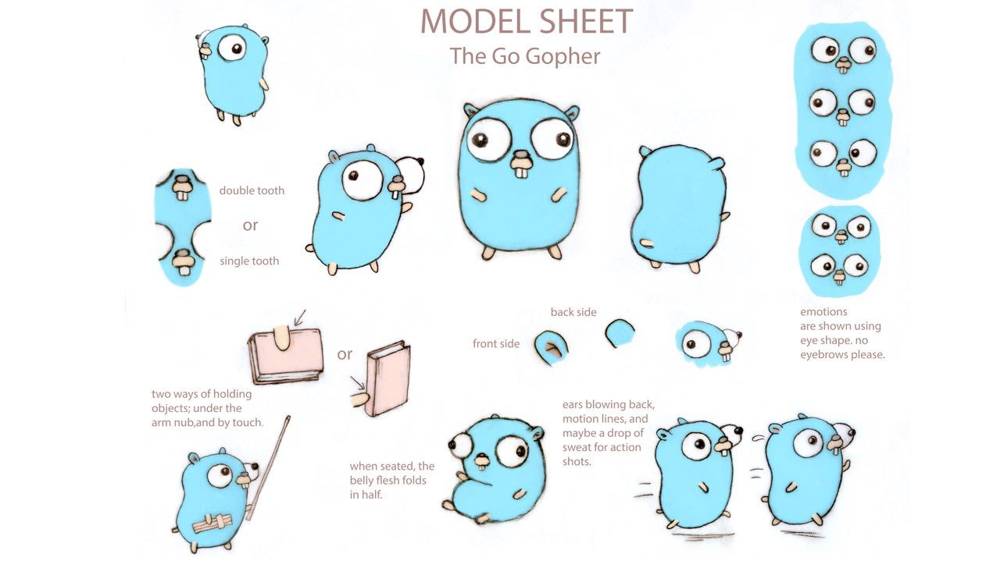

# Interacting with APIs in Golang

## Minute-by-Minute

| **Elapsed** | **Time**  | **Activity**              |
| ----------- | --------- | ------------------------- |
| 0:00        | 0:05      | Objectives                |
| 0:05        | 0:15      | Initial Exercise          |
| 0:20        | 0:40      | Overview                  |
| 1:00        | 0:10      | BREAK                     |
| 1:10	      | 0:50      | API Mini Project          |
| TOTAL       | 2:00      |                           |

## Why You Should Know This

The ability to **marshal and unmarshal objects into a particular format** is a generic skill you can leverage in any language or framework for the rest of your career. You'll be able to write code that can integrate with any third party system you have access to using this technique.

## Class Learning Objectives/Competencies (5 min)

1. Define what marshalling and unmarshalling a object means in the context of JSON.
1. Design and build your first server-side Go application.
1. Implement `struct`s that represent real-life objects from the [Public APIs List](https://github.com/toddmotto/public-apis).

## Initial Exercise (15 min)

Pull out a pen and paper and use the guide below to draw the Golang gopher in a unique pose!

Take a pic with your smartphone by the end of class and post it to our Slack channel.

## Overview (40 min)

### Introduce the Echo Framework (20 mins)

1. Break students into groups of 3 to 4.
1. Slack the link for the [Echo Framework](https://echo.labstack.com)
1. Assign a topic to each group:
    1. Optimized Router
    1. Automatic TLS
    1. Scalable
    1. HTTP/2
    1. Middleware
    1. Data Binding
    1. Data Rendering
    1. Templates
    1. Extensible
1. Ask students to research the importance of each topic, and how it is implemented in the Echo framework.
1. **Deliverable**: Slack a one-paragraph summary of each topic to our class channel --- we will review each, and the relevant code, next!

### Show & Tell (20 mins)

1. Show students a working implementation of a project that harnesses the power of JSON: [iscoding.live](https://github.com/droxey/iscoding.live)
1. Walk through the code with students and answer any questions that may come up.
1. Compare the techniques in this project with those found in the Echo framework.

## BREAK (10 min)

## In Class Activity I (50 min)

1. Break into groups of 3 to 4.
1. Select a [public API](https://github.com/toddmotto/public-apis) that doesn't require authentication of any kind.
1. Design and write `struct`s or `interface`s that can contain the data that the API returns.
1. Write a `GET` endpoint that returns a JSON with some API data that you think is interesting!
1. **Stretch Challenge**: what other endpoints could you write to leverage the data you've pulled into your Golang server?
1. **Deliverable**: Slack your project to the class channel. We will continue exploring these techniques throughout the course!

## After Class

1. Continue the Go track at [exercism.io](https://exercism.io).
