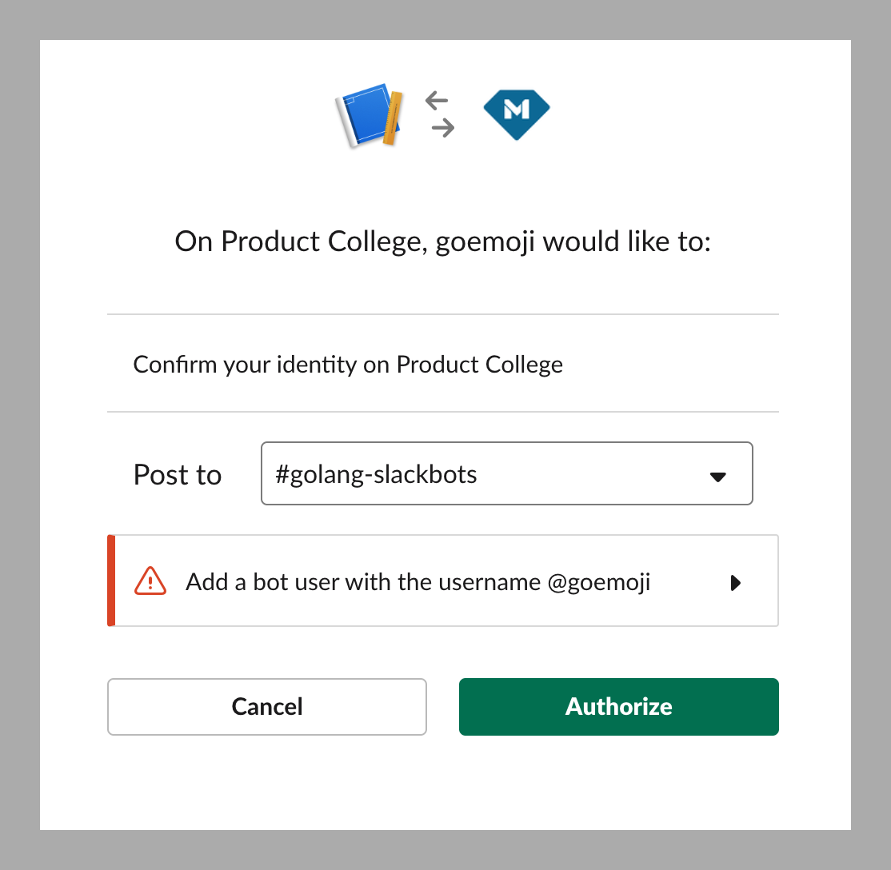

# Concurrency & Goroutines: Practical Applications

| **Elapsed** | **Time**  | **Activity**              |
| ----------- | --------- | ------------------------- |
| 0:00        | 0:05      | Objectives                |
| 0:05        | 0:30      | Overview                  |
| 0:35        | 0:15      | In Class Activity I       |
| 0:50        | 0:10      | BREAK                     |
| 0:60        | 0:50      | In Class Activity II      |
| 1:50        | 0:10      | Wrap Up                   |
| TOTAL       | 2:00      |                           |

## Why You Should Know This

`TODO` Explain why students should care to learn the material presented in this class.

## Class Learning Objectives/Competencies (5 min)

1. `TODO` Identify and describe
2. `TODO` Define
3. `TODO` Design
4. `TODO` Implement

## Overview/TT I

### Goroutines (30 min)

`TODO`: Goroutines lecture

## In Class Activity I

### Brainstorm (5 min)

1. In teams of four, brainstorm what kind of command(s) you'd like your Slackbot to perform.

### Create New Slack App (5 min)

1. [Click here](https://api.slack.com/apps?new_app=1) to point your browser to the **Create a Slack App** page.
2. Name your Slack app. Select a name that fits the problem you're trying to solve.
3. Select the Product College workspace.
4. Click the **Create App** button.
5. On the sidebar, under the Features header, choose Bot Users.
6. Git your bot a display name and a default username.
7. Click the **Save Changes** button.
8. When ready to publish, go to the OAuth & Permissions link.
9. Click **Install App to Workplace**, and make sure you set the contents of the modal dialog to match the below screenshot, ensuring bot activity for today's class will only end up in `#golang-slackbots`:


### Setup Project (5 min)

1. When your team decides on a project and name, fork this [starter repo](https://github.com/droxey/goslackit). It is best if you work from one computer today.
2. Clone the forked repo to your local machine and `cd REPO_NAME`.
3. Run `cp .env.sample .env` to create a `.env` file.
4. Paste the Bot Token from Step 9 to your `.env` file under `BOT_OAUTH_ACCESS_TOKEN`.
5. Run `go run main.go` to start the application. If it fails, please let the instructor know.


## BREAK (10 min)

## In Class Activity II

### Goroutines Challenge (40 min)

* There are 3 challenges written in the comments of the repo you forked. Search the project for `TODO` in order to find them.
* Complete each with the help of your team, examining the output and testing your bot on Slack as you complete the activity.
* If you get stuck, the following tutorial can assist: [Writing Slackbots with Goroutines](https://x-team.com/blog/writing-slackbots-with-goroutines/)
* You may also want to read about [Slack Bot Users](https://api.slack.com/bot-users) in order to know all about enabling an integration with a bot.
* An additional **stretch challenge** is available if you finish early.

## Wrap Up

### Heroku Deployment (10 min)

Deploying your bot means it will run forever --- even if your computer is turned off! Use this sample script to deploy your bot to Heroku:

```bash
$ git clone git@github.com:PROJECT_NAME/REPO_NAME.git
$ cd REPO_NAME
$ heroku create PROJECT_NAME
$ heroku config:set PROJECT_NAME_SLACK_TOKEN=YOUR_TOKEN
$ git push heroku master
$ heroku ps:scale worker=1
```

